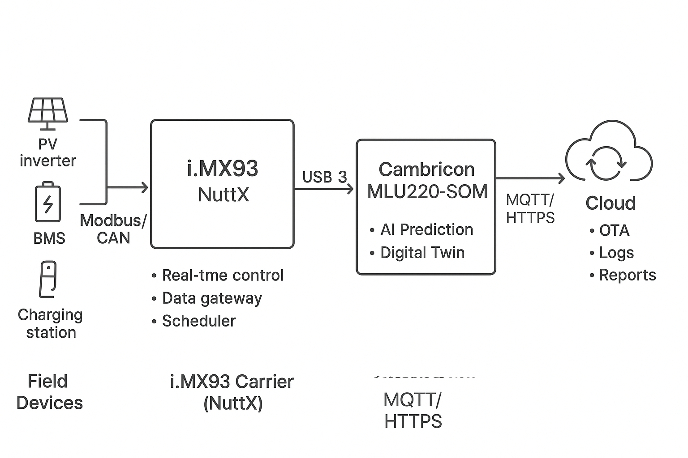

# Section 1. Introduction

## 微网的应用

### 工商业微网
    •        光伏自发自用 + 储能削峰填谷 - - - 经济模式、备电模式、节能模式
    •        EMS自动决定“什么时候充电/放电” - - 动态调整充放电时间计划表、功率、价格；最好结合外部电价、天气预测、设备健康程度等
    •        用户电费下降 10-30%; --- 收益优先策略，降低电费支出.
    •        精细化运行，减少人力干预；提高运营效率

### 园区和社区能源系统
    •        光伏+储能+充电桩的综合调度 - - - 家庭储能
    •        EMS可以实现“优先使用光伏 → 余电充电桩 → 高峰期从储能供电”

### 独立微电网(离网/弱电网地区)
    •        光伏+柴油机+储能的混合调度 --- 离网策略
    •        EMS决定什么时候启停柴油机,降低油耗 --- 动态调整

# Section 2. Theoretical Background

## 微网架构设计

